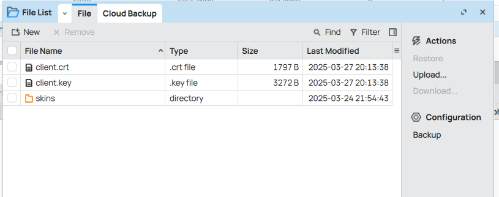
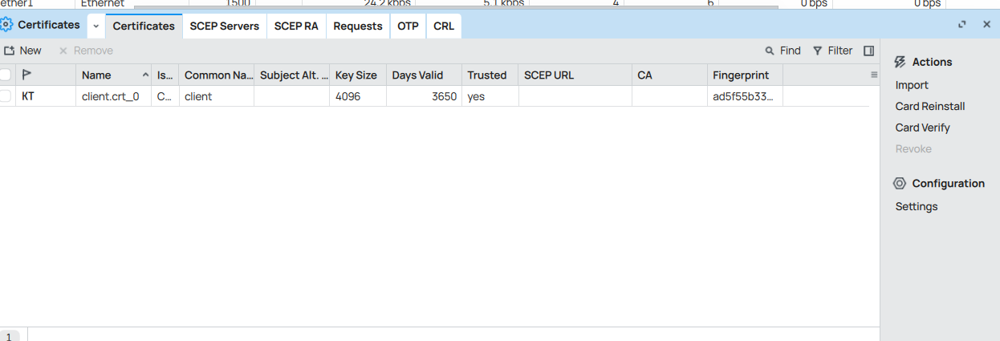
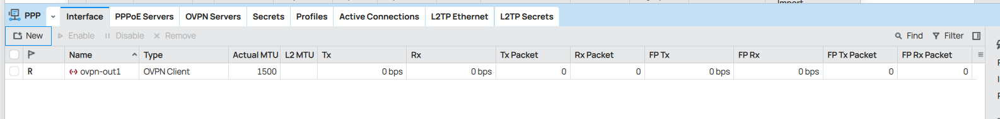
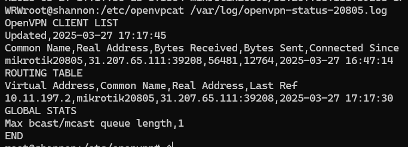
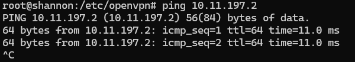
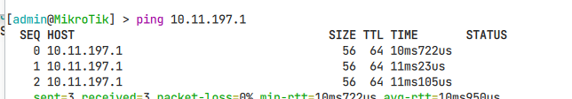
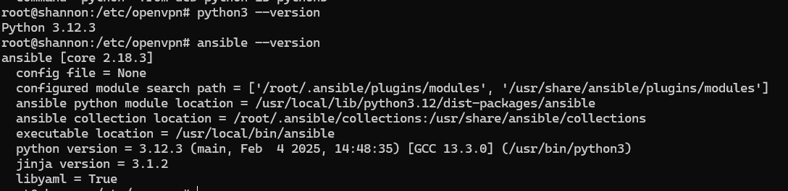

University: [ITMO University](https://itmo.ru/ru/)

Faculty: [PIN](https://fict.itmo.ru)

Course: [Network programming](https://itmo-ict-faculty.github.io/network-programming/)

Year: 2024/2025

Group: K3320

Author: Gusev Yaroslav Aleksandrovich

Lab: [Lab1](https://itmo-ict-faculty.github.io/network-programming/education/labs2023_2024/lab1/lab1/)

Date of create: 26.03.2025

Date of finished: 27.03.2025


# Настройка сервера open vpn

Настройка сервера была произведена при помощи [скрипта](https://github.com/unixhostpro/mikrotik-ovpn/blob/master/openvpn-server.sh). Был поднят open vpn со следующей конфигурацией:
```
daemon
mode server
tls-server
port 20805
proto tcp
dev tun20805
log /var/log/openvpn-20805.log
status /var/log/openvpn-status-20805.log
ca /etc/openvpn/mikrotik-ssl/ca-20805.crt
cert /etc/openvpn/mikrotik-ssl/server-20805.crt
key /etc/openvpn/mikrotik-ssl/server-20805.key
dh /etc/openvpn/mikrotik-ssl/dh2048-20805.pem
topology subnet
server 10.11.197.0 255.255.255.0
client-to-client
ifconfig-pool-persist ipp.txt
username-as-common-name
push "dhcp-option DNS 1.1.1.1"
push "dhcp-option DNS 8.8.8.8"
user nobody
group nogroup
keepalive 10 120
persist-key
persist-tun
auth sha1
cipher AES-256-CBC
verb 5
script-security 2
up /etc/openvpn/server-up.sh
down /etc/openvpn/server-down.sh
plugin /usr/lib/x86_64-linux-gnu/openvpn/plugins/openvpn-plugin-auth-pam.so login
```

Сервер:
- Принимает VPN-подключения на TCP 20805.

- Шифрует соединение через TLS + AES-256-CBC.

- Аутентифицирует клиентов через PAM.

- Выдаёт IP-адреса из сети 10.11.197.0/24.

# Настройка клиента в CHR и подключение к vpn

В виртуальной машине virtualbox был запущен mikrotik CHR.
Забираем с сервера сгенерированный сертификат и ключ для клиента, подключаемся к виртуальной машине через winbox.

Копируем ключ и сертификат на роутер.



Устанавливаем сертификат (system - certificates)



Создаём ovpn соединение, указав параметры соединения, логин и пароль. 



# Проверка работоспособности

Проверим status лог на сервере:



Видим, что клиент успешно подключился, получил айпи 10.11.197.2.

Сделаем пинг клиента с сервера, и наоборот.





Связь есть.

Также на сервер был поставлен ansible и python

